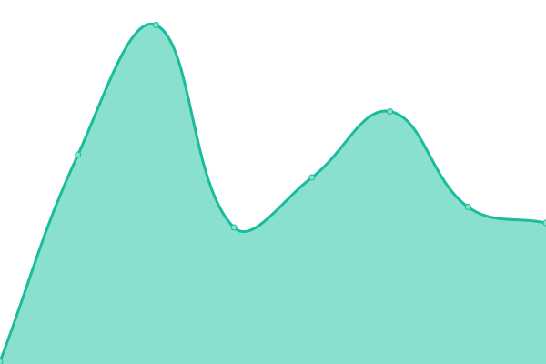
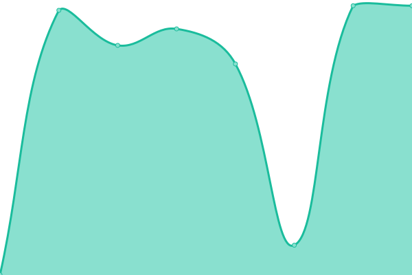
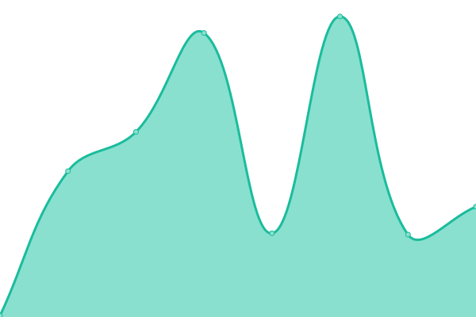

# [📈 Live Status](https://x.siraphop.me): <!--live status--> **🟩 All systems operational**

This repository contains the open-source uptime monitor and status page for [Siraphop Sukchu](https://siraphop.me/), powered by [Upptime](https://github.com/upptime/upptime).

With [Upptime](https://upptime.js.org), you can get your own unlimited and free uptime monitor and status page, powered entirely by a GitHub repository. We use [Issues](https://github.com/FujaTyping/Upptime/issues) as incident reports, [Actions](https://github.com/FujaTyping/Upptime/actions) as uptime monitors, and [Pages](https://x.siraphop.me) for the status page.

<!--start: status pages-->
<!-- This summary is generated by Upptime (https://github.com/upptime/upptime) -->
<!-- Do not edit this manually, your changes will be overwritten -->
<!-- prettier-ignore -->
| URL | Status | History | Response Time | Uptime |
| --- | ------ | ------- | ------------- | ------ |
|  [Personal Website](https://dfujatyping.web.app/) | 🟩 Up | [personal-website.yml](https://github.com/FujaTyping/Upptime/commits/HEAD/history/personal-website.yml) | 

 115ms
     
 | 

<a href="https://x.siraphop.me/history/personal-website">100.00%</a>
    

|  [Shop Website](https://shopdfujatyping.web.app/) | 🟩 Up | [shop-website.yml](https://github.com/FujaTyping/Upptime/commits/HEAD/history/shop-website.yml) | 

 101ms
     
 | 

<a href="https://x.siraphop.me/history/shop-website">100.00%</a>
    

|  [Link Portal](https://portal-azure-rho.vercel.app/) | 🟩 Up | [link-portal.yml](https://github.com/FujaTyping/Upptime/commits/HEAD/history/link-portal.yml) | 

 1162ms
     
 | 

<a href="https://x.siraphop.me/history/link-portal">100.00%</a>
    

|  [Envision Project](https://sma7tenvision.web.app/) | 🟩 Up | [envision-project.yml](https://github.com/FujaTyping/Upptime/commits/HEAD/history/envision-project.yml) | 

 113ms
     
 | 

<a href="https://x.siraphop.me/history/envision-project">100.00%</a>
    

<!--end: status pages-->

[**Visit our status website →**](https://x.siraphop.me)

## 📄 License

- Powered by: [Upptime](https://github.com/upptime/upptime)
- Code: [MIT](./LICENSE) © [Anand Chowdhary](https://anandchowdhary.com), supported by [Pabio](https://pabio.com)
- Data in the `./history` directory: [Open Database License](https://opendatacommons.org/licenses/odbl/1-0/)
